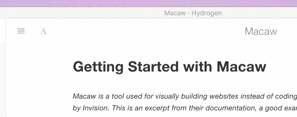

# Typography Examples

Before diving into the details of a full typography test (feel free to skip that), you can have a play around with some basic settings in the top right.



## Headings

Headings from `h1` through `h6` are constructed with a `#` for each level:

``` markdown
# h1 Heading
## h2 Heading
### h3 Heading
#### h4 Heading
##### h5 Heading
###### h6 Heading
```

## Horizontal Rules

The HTML `<hr>` element is for creating a "thematic break" between paragraph-level elements. In markdown, you can create a `<hr>` with any of the following:

* `___`: three consecutive underscores
* `---`: three consecutive dashes
* `***`: three consecutive asterisks

---

## Body Copy

Body copy written as normal, plain text will be wrapped with `<p></p>` tags in the rendered HTML.

So this body copy:

``` markdown
Lorem ipsum dolor sit amet, graecis denique ei vel, at duo primis mandamus. Et legere ocurreret pri, animal tacimates complectitur ad cum. Cu eum inermis inimicus efficiendi. Labore officiis his ex, soluta officiis concludaturque ei qui, vide sensibus vim ad.
```
renders to this HTML:

``` html
<p>Lorem ipsum dolor sit amet, graecis denique ei vel, at duo primis mandamus. Et legere ocurreret pri, animal tacimates complectitur ad cum. Cu eum inermis inimicus efficiendi. Labore officiis his ex, soluta officiis concludaturque ei qui, vide sensibus vim ad.</p>
```

## Emphasis

### Bold
For emphasizing a snippet of text with a heavier font-weight.

The following snippet of text is **rendered as bold text**.

``` markdown
**rendered as bold text**
```

### Italics
For emphasizing a snippet of text with italics.

The following snippet of text is _rendered as italicized text_.

``` markdown
_rendered as italicized text_
```

### Strikethrough
You can also do ~~strikethroughs~~.

``` markdown
~~Strike through this text.~~
```

## Blockquotes
For quoting blocks of content from another source within your document.

> Add `>` before any text you want to quote.

## Lists

### Unordered
A list of items in which the order of the items does not explicitly matter.

You may use any of the following symbols to denote bullets for each list item:

```markdown
* valid bullet
- valid bullet
+ valid bullet
```

For example:

``` markdown
+ Lorem ipsum dolor sit amet
+ Consectetur adipiscing elit
+ Integer molestie lorem at massa
+ Facilisis in pretium nisl aliquet
+ Nulla volutpat aliquam velit
  - Phasellus iaculis neque
  - Purus sodales ultricies
  - Vestibulum laoreet porttitor sem
  - Ac tristique libero volutpat at
+ Faucibus porta lacus fringilla vel
+ Aenean sit amet erat nunc
+ Eget porttitor lorem
```
Renders to:

+ Lorem ipsum dolor sit amet
+ Consectetur adipiscing elit
+ Integer molestie lorem at massa
+ Facilisis in pretium nisl aliquet
+ Nulla volutpat aliquam velit
  - Phasellus iaculis neque
  - Purus sodales ultricies
  - Vestibulum laoreet porttitor sem
  - Ac tristique libero volutpat at
+ Faucibus porta lacus fringilla vel
+ Aenean sit amet erat nunc
+ Eget porttitor lorem

### Ordered

A list of items in which the order of items does explicitly matter.

``` markdown
1. Lorem ipsum dolor sit amet
2. Consectetur adipiscing elit
3. Integer molestie lorem at massa
4. Facilisis in pretium nisl aliquet
5. Nulla volutpat aliquam velit
6. Faucibus porta lacus fringilla vel
7. Aenean sit amet erat nunc
8. Eget porttitor lorem
```
Renders to:

1. Lorem ipsum dolor sit amet
2. Consectetur adipiscing elit
3. Integer molestie lorem at massa
4. Facilisis in pretium nisl aliquet
5. Nulla volutpat aliquam velit
6. Faucibus porta lacus fringilla vel
7. Aenean sit amet erat nunc
8. Eget porttitor lorem

## Code

For example, to apply syntax highlighting to JavaScript code:

<pre>
``` javascript
grunt.initConfig({
  ...
};
```
</pre>

Which renders to:

``` javascript
grunt.initConfig({
  assemble: {
    options: {
      assets: 'docs/assets',
      data: 'src/data/*.{json,yml}',
      helpers: 'src/custom-helpers.js',
      partials: ['src/partials/**/*.{hbs,md}']
    },
    pages: {
      options: {
        layout: 'default.hbs'
      },
      files: {
        './': ['src/templates/pages/index.hbs']
      }
    }
  }
};
```

## Tables
Tables are created by adding pipes as dividers between each cell, and by adding a line of dashes (also separated by bars) beneath the header. Note that the pipes do not need to be vertically aligned.

``` markdown
| Option | Description |
| ------ | ----------- |
| data   | path to data files to supply the data that will be passed into templates. |
| engine | engine to be used for processing templates. Handlebars is the default. |
| ext    | extension to be used for dest files. |
```

Renders to:

| Option | Description |
| ------ | ----------- |
| data   | path to data files to supply the data that will be passed into templates. |
| engine | engine to be used for processing templates. Handlebars is the default. |
| ext    | extension to be used for dest files. |


### Right aligned text

Adding a colon on the right side of the dashes below any heading will right align text for that column.

``` markdown
| Option | Description |
| ------:| -----------:|
| data   | path to data files to supply the data that will be passed into templates. |
| engine | engine to be used for processing templates. Handlebars is the default. |
| ext    | extension to be used for dest files. |
```

| Option | Description |
| ------:| -----------:|
| data   | path to data files to supply the data that will be passed into templates. |
| engine | engine to be used for processing templates. Handlebars is the default. |
| ext    | extension to be used for dest files. |

## Links

``` markdown
[Packt](http://packtpub.com)
```

Renders to [Packt](http://packtpub.com)

## Images
Images have a similar syntax to links but include a preceding exclamation point.

``` markdown

```

