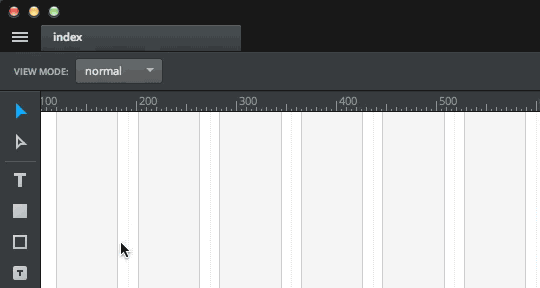

# Getting Started with Macaw

*Macaw is a tool used for visually building websites instead of coding directly in HTML and CSS. It was recently acquired by Invision. This is an excerpt from their documentation, a good example of using animated GIFs as part of a tutorial.*

## Drawing with Macaw

The primary way of creating elements in Macaw is drawing. Macaw allows you to draw numerous types of elements by simply **clicking and dragging** on the canvas.

### Snap

You can toggle Snap by selecting **View > Toggle Snap** or pressing **Ctrl+U**. When enabled, your cursor will snap to the grid, canvas boundaries and other elements as you draw.

### Select

The select element is basically a drop-down list. You can modify the available options for the select using the list builder in the Inspector. You can add an option by clicking the + button. Double-clicking the option name allows you to edit the text. Click and drag an option to rearrange it and click the trash icon to delete it. Note: the first option will be used as the default.

### Checkbox & Radio

Checkbox and radio elements can be drawn by clicking and dragging on the canvas with their respective tools. Both elements have a minimum width of 66 px and minimum height of 22 px, that are applied when drawing, but can be adjusted later.

When a checkbox or radio element is added to the canvas, three elements are actually created: a checkbox or radio, a label and a container for them both.

