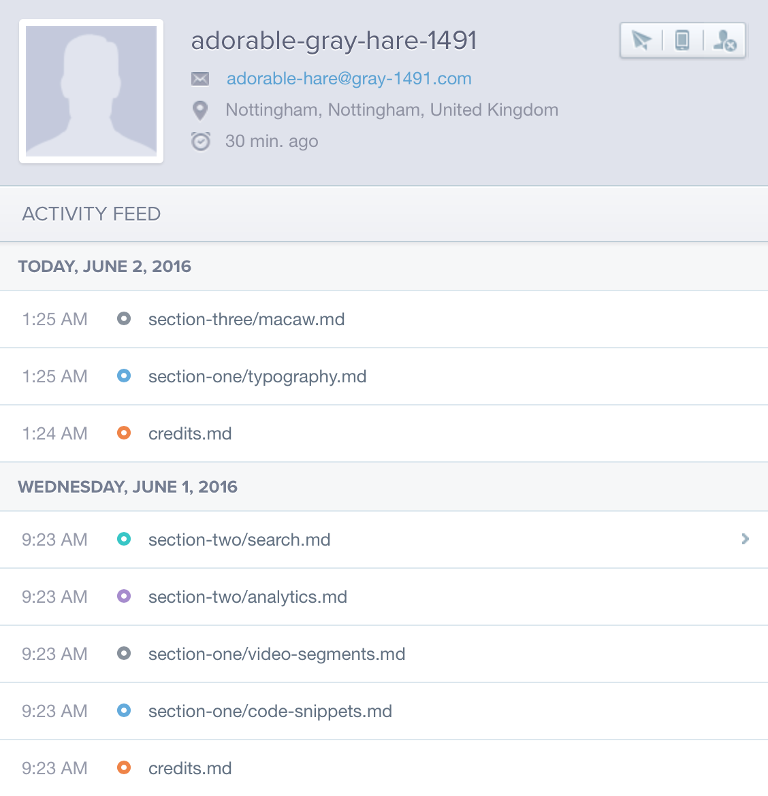

# Analytics and You

We don't currently have an opt-out for analytics yet, so everybody running this application will be sending data back to a particular Mixpanel instance that has been setup specifically for this demo. We should add this as an opt-in application flag before distribution. The main events we track are page loads, and because this application is effectively our own sandbox, we can be sure that user profiles persist across sessions.





This is just a fancy way of saying we can have user-level analytics and progression/usage tracking for everybody who downloads one of these things (if they're okay with that). The setup involved is minimal, as we've packaged up all of the Packt-specific functionality into an npm module.

It's as simple as setting up a Mixpanel project, and then updating the project configuration file to include the appropriate token:

```json
"mixpanel": {
  "token": "85c6c341ff619c9b9eb63b8e6e5de4bf"
}
```

That's the token for this instance.
