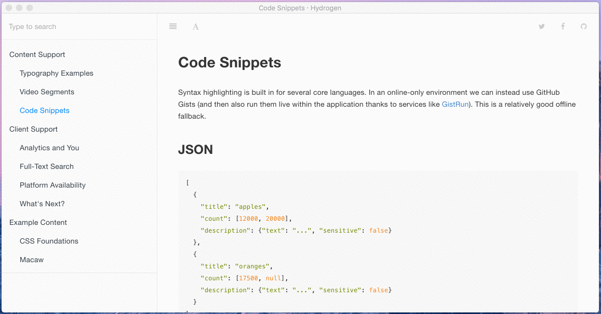

# Full-Text Search

A brief note about search. It's powered by Lunr, which is an 'offline' version of Solr. When the content is being converted to XML, a static JSON file is built that acts as a search index. If we were trying to do this for thousands of books, it wouldn't work very well - but because we're expecting these application containers to be used for individual products/courses, it does the job.

Try searching for a term you might have remembered from another section, to see how it works. If you really can't think of one, try *minion*.
